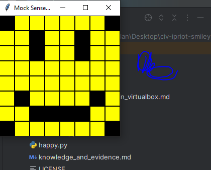
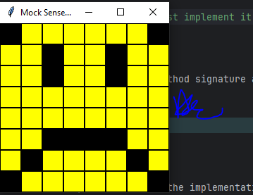

<style>

body {
    counter-reset: h2counter;
}

/* H1 - No numbering */
h1 {
    /* No counter reset or increment */
}

/* H2 - Level 1 numbering */
h2 {
    counter-reset: h3counter;
}

h2::before {
    counter-increment: h2counter;
    content: counter(h2counter) ". ";
}

/* H3 - Level 2 numbering */
h3 {
    counter-reset: h4counter;
}

h3::before {
    counter-increment: h3counter;
    content: counter(h2counter) "." counter(h3counter) " ";
}

/* H4 - Level 3 numbering (optional) */
h4 {
    counter-reset: h5counter;
}

h4::before {
    counter-increment: h4counter;
    content: counter(h2counter) "." counter(h3counter) "." counter(h4counter) " ";
}

</style>

# Evidence and Knowledge

This document includes instructions and knowledge questions that must be completed to receive a *Competent* grade on this portfolio task.

## Required evidence

### Answer all questions in this document

- Each answer should be complete, well-articulated, and within the specified word count limits (if added) for each question.
- Please make sure **all** external sources are properly cited.
- You must **use your own words**. Please include your full chat transcripts if you use generative AI in any way.
- Generative AI hallucinates, is not an authoritative source

### Make all the required modifications to the code

- Please follow the instructions in this document to make the changes needed to the code.

- When requested to upload evidence, upload all screenshots to `screenshots/` and embed them in this document. For example:

```markdown

```

- You must upload the code into your GitHub repository.
- While you can use a branch, your code should be in main when you submit.
- Upload a zip of this repository to Blackboard when you are ready to submit.
- You will be notified of your result via Blackboard
- However, if using GitHub classrooms, you may also receive additional feedback on GitHub directly

### Optional: Use of Raspberry Pi and SenseHat

Raspberry Pi or SenseHat is **optional** for this activity. You can use the included `sense_hat.py` file to simulate the SenseHat on your computer.

If you use a Pi, please **delete** the `sense_hat.py` file.

### Accessible version of the code

This project relies on visual patterns that appear on an LED matrix. If you have any accessibility requirements, you can use the `udl/accessible` branch to complete the project. This branch provides an accessible code version that uses text-based patterns instead of visual ones.

Please discuss this with your lecturer before using that branch.

## Specific Tasks & Questions

Address the following tasks and questions based on the code provided in this repository.

### Set up the project locally

1. Fork this repository (if not using GitHub Classrooms)
2. Clone your repository locally
3. Run the project locally by executing the `main.py` file
4. Evidence this by providing screenshots of the project directory structure and the output of the `main.py` file



If you are running on a Raspberry Pi, you can use the following command to run the project and then screenshot the result:

```bash
ls
python3 main.py
```

### Fundamental code comprehension

 Answer each of the following questions **as they relate to that code** supplied by in this repository (ignore `sense_hat.py`):

1. Examine the code for the `smiley.py` file and provide  an example of a variable of each of the following types and their corresponding values (`_` should be replaced with the appropriate values):

   | Type                    | name  | value           |
   | ----------              |-------|-----------------|
   | built-in primitive type | dimmed | True            |
   | built-in composite type | WHITE | (255, 255, 255) |
   | user-defined type       | self.sense_hat      | SenseHat()      |

2. Fill in (`_`) the following table based on the code in `smiley.py`:

   | Object                   | Type           |
   | ------------             |----------------|
   | self.pixels              | Composite type |
   | A member of self.pixels  | Composite type |
   | self                     | Smiley         |

3. Examine the code for `smiley.py`, `sad.py`, and `happy.py`. Give an example of each of the following control structures using an example from **each** of these files. Include the first line and the line range:

   | Control Flow | File      | First line              | Line range |
   | ------------ |-----------|-------------------------|------------|
   |  sequence    | smiley.py | WHITE = (255, 255, 255) | 5 - 9      |
   |  selection   | sad.py    | if wide_open:           | 26 - 29    |
   |  iteration   | happy.py  | for pixel in mouth:     | 21 - 22    |

4. Though everything in Python is an object, it is sometimes said to have four "primitive" types. Examining the three files `smiley.py`, `sad.py`, and `happy.py`, identify which of the following types are used in any of these files, and give an example of each (use an example from the code, if applicable, otherwise provide an example of your own):

   | Type  | Used? | Example                                                                     |
   |-------|-------|-----------------------------------------------------------------------------|
   | int   | Yes   | WHITE = (255, 255, 255) "the variable WHITE is a TUPLE which contains INTs" |
   | float | Yes   | def blink(self, delay=0.25)                                                 |
   | str   | No    | greeting = "hello"                                                          |
   | bool  | Yes   | def dim_display(self, dimmed=True)                                          |

5. Examining `smiley.py`, provide an example of a class variable and an instance variable (attribute). Explain **why** one is defined as a class variable and the other as an instance variable.

> WHITE = (255, 255, 255) is a Class Variable | This is defined as a class variable because the variable is in the class body (not within a class method like init), this means the variable is defined when the class is defined and is shared among all instances of the class. Modifying the value of a class variable then, effects all each instance of the class variable. 

>Y = self.YELLOW is an instance variable. |  An instance variables are set at initialization, or within the (__init__) method, when you create an instance of the class. It is generally expected then that the value of each instance can be unique to each instance since you can set this at every initialization, or we can change the variable without affecting other instanes.  
> 
> 
> 
>

6. Examine `happy.py`, and identify the constructor (initializer) for the `Happy` class:
   1. What is the purpose of a constructor (in general) and this one (in particular)?

   > The purpose of a constructor is to define attributes when the instance is initialized.
   > In the case of the constructor in class Happy; it will define an instance of the class that will inherit the attributes or the instance variables which Smiley or Blinkable have in their init methods. In this case, Blinkable has no init method, Happy will inherit them from Smiley (self.sense_hat which contains the SenseHat class and self.pixels which contains a list of tuples). 

   2. What statement(s) does it execute (consider the `super` call), and what is the result?

   > The constructor also includes "self.draw_mouth() and self.draw_eyes()" in sequence. Meaning that when an instance of this class is initialized, the two methods will be executed.
   >

### Code style

1. What code style is used in the code? Is it likely to be the same as the code style used in the SenseHat? Give to reasons as to why/why not:
   
> PEP8.
> Yes, it is like likely the code style is the same in SenseHate. Firstly, in smiley.py ("self.sense_hat" | line: 13) the class name itself follows PEP8 protocol; "SenseHat" uses the CamelCase convention to imply the object is a class. Furthermore, staying within smiley.py, we can see two instances of self.sense_hat calling functions which also adhere to PEP8 naming styles. Examples, (line 33) we have "self.sense_hat.low_light" and (line 39) "self.sense_hate.set_pixels". Both the lines are calling functions which adhere to PEP8 protocols by keeping the words lowercase and seperated with underscores.
>

2. List three aspects of this convention you see applied in the code.

> 1. In smiley.py (line range: 5 - 9) we can see in the class body of smiley a sequence of constants distinguished as such by their naming convention which is all uppercase.
> 2. For the next example we can look at sad.py. (line: 15 | "mouth = [49, 54, 42, 43, 44, 45]") we can see looking at this example it follows PEP8 conventions by surrounding the "=" with a single white space.
> 3. Lastly, lets look at happy.py. (line: 16 | "def draw_mouth(self)") we can see the same of this method follows PEP8 conventions by keeping the name in underscores and keeping words in the name serperated with an underscore.
>

3. Give two examples of organizational documentation in the code.

> smiley.py (line: 12) uses a hash comment to describe what is happening in the init method "# We have encapsulated the SenseHat object"
> Also, within smiley.py (line: 29 - 32), we have a docstring comment describing how the dim_display method works """" Set the SenseHat's light intensity to low (True) or high (False) :param dimmed: Dim the display if True, otherwise don't dim""""
>

### Identifying and understanding classes

> Note: Ignore the `sense_hat.py` file when answering the questions below

1. List all the classes you identified in the project. Indicate which classes are base classes and which are subclasses. For subclasses, identify all direct base classes.
  
  Use the following table for your answers:

| Class Name | Super or Sub? | Direct parent(s)   |
|------------|---------------|--------------------|
| NotReal    | Sub           | NotRealParent      |
| smiley     | super         | none               |
| blinkable  | sub           | ABC                |
| sad        | sub           | smiley             |
| happy      | sub           | smiley + blinkable |

2. Explain the concept of abstraction, giving an example from the project (note "implementing an ABC" is **not** in itself an example of abstraction). (Max 150 words)

> Ultimately, the purpose of abstraction is to simplify/hide the internal working of the class but allow for flexibility. This often done by defining an abstract method. When subclass inherits from the abstract class or interface, it must implement concrete definitions of them. If we look at blinkable.py it inherits from the superclass (abc=abstract base class), and defines the method "blink" as an abstract method using a decorator "@abstractmethod". Which does contains no implementation but all sub-classes which inherit from blinkable must give this method implementation. 
>

3. What is the name of the process of deriving from base classes? What is its purpose in this project? (Max 150 words)

> The name of the process is called inheritance and the purpose within this project is code re-use.
>

### Compare and contrast classes

Compare and contrast the classes Happy and Sad.

1. What is the key difference between the two classes?
   > sad does not import the time module, nor import or inherit from blinkable. It does not define a method called blink.
   >
2. What are the key similarities?
   > Both sad and happy inherit from smiley. Both share two defined methods "draw_eyes" and "draw_mouth" with the same implementation
   >
3. What difference stands out the most to you and why?
   > sad does not inherit from blinkable nor define a method called "blink". This stands out most to me because it is a key 
   >
4. How does this difference affect the functionality of these classes
   > without sad inheriting the blink method from blinkable for implementation, in order for sad to achieve 
   >

### Where is the Sense(Hat) in the code?

1. Which class(es) utilize the functionality of the SenseHat?
   > Smiley and Happy. Smiley imports the sense_hat class/module and then encapsulates it in an instance variable called self.sense_hat. self.sense_hat is used in the methods dim_display and show. The show method in then used in the implementation of the blink method in happy. 
   >
2. Which of these classes directly interact with the SenseHat functionalities?
   > Smiley does but since SenseHat is encapsulated by being instance variable called self.sense_hat in the smiley class, and its functionality only being accessed from the methods definied in smiley, all classes which inherit from smiley interact only with the methods which are defined by smiley. Smiley can interact with SenseHat but happy and sad (if they inherit from smiley) cannot, they interact using methods from the parent class.
   >
3. Discuss the hiding of the SenseHAT in terms of encapsulation (100-200 Words)
   > SenseHat is imported by smiley and then the SenseHat class(or module) is assigned to the instance variable self.sense_hat. This is in turn used in the methods defined in smiley called dim_display and show. When class inherits from smiley, they will interact with SenseHat only through the methods defined by smiley. They cannot change or alter anything or directly interface with SenseHat.
   >

### Sad Smileys Can’t Blink (Or Can They?)

Unlike the `Happy` smiley, the current implementation of the `Sad` smiley does not possess the ability to blink. Let's first explore how blinking has been implemented in the Happy Smiley by examining the blink() method, which takes one argument that determines the duration of the blink.

**Understanding Blink Mechanism:**

1. Does the code's author believe that every `Smiley` should be able to blink? Explain.

> No because smiley does not define an abstract method which it expects all the sub-classes derived from smiley to implement.
>

2. For those smileys that blink, does the author expect them to blink in the same way? Explain.

> no, the method in happy for example is inherited from an abstract method and defined in smiley. The point of the abstract method is not to enforce how the child classes implement the abstract method but that they must implement it *somehow*. In the case of smiley we can clearly see that we can change the delay or even how many times it blinks (by using adding more uses of its methods like show or draw_eyes). So every smiley which may have a blink method is not expect them to blink the same 
>

3. Referring to the implementation of blink in the Happy and Sad Smiley classes, give a brief explanation of what polymorphism is.

> Polymorphism refers to how we can implement something, for instance a method, across classes but potentially use it differently every time. In the case of blink, as previously mentioned, we can implement the abstract method "blink" differently in any class that has the method through either inheritance or implementing the same method across classes which are not linked.
>

4. How is inheritance used in the blink method, and why is it important for polymorphism?

> Happy inherits the blink method from blinkable, but it is an abstract method and so must implement it within the method definition - meaning happy smiley implements what the blink method will do. This is important for polymorphism as it encourages the ability to use blink inherited from blinkable in many different ways. Happy smiley can implement blink in one way, sad smiley another, angry smiley another way again and so forth. 
>
1. **Implement Blink in Sad Class:**

   - Create a new method called `blink` within the Sad class. Ensure you use the same method signature as in the Happy class:

   ```python
   def blink(self, delay=0.25):
       pass  # Replace 'pass' with your implementation
   ```

2. **Code Implementation:** Implement the code that allows the Sad smiley to blink. Use the implementation from the Happy Smiley as a reference. Ensure your new method functions similarly by controlling the blink duration through the `delay` argument.

3. **Testing the Implementation:**

- Test the new blink functionality on your Raspberry Pi or within the Python classes provided. You might need to adjust the `main.py` script to incorporate Sad Smiley's new blinking capability.

Include a screenshot of the sad smiley or the modified `main.py`:



- Observe and document the Sad smiley as it blinks its eyes. Describe any adjustments or issues encountered during implementation.

  > I had to import the time module in order for it to work like the happy smiley.

  ### If It Walks Like a Duck…

  Previously, you implemented the blink functionality for the Sad smiley without utilizing the class `Blinkable`. Assuming you did not use `Blinkable` (even if you actually did), consider how the Sad smiley could blink similarly to the Happy smiley without this specific class.

  1. **Class Type Analysis:** What kind of class is `Blinkable`? Inspect its superclass for clues about its classification.

     > Abstract class 

  2. **Class Implementation:** `Blinkable` is a class intended to be implemented by other classes. What generic term describes this kind of class, which is designed for implementation by others? **Clue**: Notice the lack of any concrete implementation and the naming convention.

  > Interface 

  3. **OO Principle Identification:** Regarding your answer to question (2), which Object-Oriented (OO) principle does this represent? Choose from the following and justify your answer in 1-2 sentences: Abstraction, Polymorphism, Inheritance, Encapsulation.

  > Abstraction: Abstraction and interface are closely linked. Ultimately, abstraction is about hiding the more complicated details and saying an object must do this without must care about how it does it. An interface is like a blueprint of what the derivatives must do but allows them to be implements in their own way.

  4. **Implementation Flexibility:** Explain why you could grant the Sad Smiley a blinking feature similar to the Happy Smiley's implementation, even without directly using `Blinkable`.

  > Utilizing polymorphism. Inheritance is a big part of implementing polymorphism but not the only way. Outside of inheritance, we can define a method within a class with the same name of a method inherited by another class without the shared parent class and call them the same way but have them do different things (or the same things, depending on what you define in the method). 

  5. **Concept and Language Specificity:** In relation to your response to question (4), what is this capability known as, and why is it feasible in Python and many other dynamically typed languages but not in most statically typed programming languages like C#? **Clue** This concept is hinted at in the title of this section.

  > Duck typing. Simply this means that you can use the object and don't have to worry about what class it really is or caring about data type. Meaning as long as the class has the method you are calling it will work, even if how the method works differs from class to class. Duck typing is less feasible in static typed languages because they are more strict about checking and declaring data type.  

  ***

  ## Refactoring

  ### Does a Smiley Have to Be Yellow?

  While our current implementation predominantly features yellow smileys, emotional expressions like sickness or anger typically utilize colors like green, red, or orange. We'll explore the feasibility of integrating these colors into our smileys.

  1. **Defined Colors and Their Location:**

     1. Which colors are defined and in which class(s)?
        > White, Green, Red, Yellow, Blank. They are defined in the class body of class smiley. 
     2. What type of variables hold these colors? Are the values expected to change during the program's execution? Explain your answer.
        > Constants. Constants are variables, usually indicated by all caps, which are expected  to remain as defined. 
     3. Add the color blue to the appropriate class using the appropriate format and values.

  2. **Usage of Color Variables:**

     1. In which classes are the color variables used?
        > smiley, happy and sad

  3. **Simple Method to Change Colors:**
  4. What is the easiest way you can think to change the smileys to green? Easiest, not necessarily the best!
     > Change "Y = self.YELLOW" in smiley to "Y = insert colour"

  Here's a revised version of the "Flexible Colors – Step 1" section for the smiley project, incorporating your specifications for formatting and content updates:

  ### Flexible Colors – Step 1

  Changing the color of the smileys once is straightforward, but it isn't very flexible. To facilitate various colors for smileys, it is advisable not to hardcode values in any class. This approach was identified earlier as a necessary change. Let's start by removing the built-in assumptions about color in our classes.

  1. **Add a method called `complexion` to the `Smiley` class:** Implement this instance method to return `self.YELLOW`. Using the term "complexion" instead of "color" provides a more abstract terminology that focuses on the meaning rather than implementation.

  2. **Refactor subclasses to use the `complexion` method:** Modify any subclass that directly accesses the color variable to instead utilize the new `complexion` method. This ensures that color handling is centralized and can be easily modified in the future.

  3. **Determine the applicable Object-Oriented principle:** Consider whether Abstraction, Polymorphism, Inheritance, or Encapsulation best applies to the modifications made in this step.

  4. **Verify the implementation:** Ensure that the modifications function as expected. The smileys should still display in yellow, confirming that the new method correctly replaces the direct color references.

  This step is crucial for setting up a more flexible system for color management in the smiley display logic, allowing for easy adjustments and extensions in the future.

  ### Flexible Colors – Step 2

  Having removed the hardcoded color values, we now enhance the base class to support dynamic color assignments more effectively.

  1. **Modify the `__init__()` method in the `Smiley` class:** Introduce a default argument named `complexion` and assign `YELLOW` as its default value. This allows the instantiation of smileys with customizable colors.

  2. **Introduce a new instance variable:** Create a variable called `my_complexion` and assign the `complexion` parameter to it. This step ensures that each smiley instance can maintain its own color state.

  3. **Rationale for `my_complexion`:** Using a distinct instance variable like `my_complexion` avoids potential conflicts with the method parameter names and clarifies that it is an attribute specific to the object.

  4. **Bulk rename:** We want to update our grid to use the value of complexion, but we have so many `Y`'s in the grid. Use your IDE's refactoring tool to rename all instances of the **symbol** `Y` to `X`. Where `X` is the value of the `complexion` variable. Include a screenshot evidencing you have found the correct refactor tool and the changes made.

  

  5. **Update the `complexion` method:** Adjust this method to return `self.my_complexion`, ensuring that whatever color is assigned during instantiation is what the smiley displays.

  6. **Verification:** Run the updated code to confirm that Smileys still defaults to yellow unless specified otherwise.

  ### Flexible Colors – Step 3

  With the foundational changes in place, it's now possible to implement varied smiley colors for different emotional expressions.

  1. **Adjust the `Sad` class initialization:** In the `Sad` class's initializer method, change the superclass call to include the `complexion` argument with the value `self.BLUE`, as shown:

     ```python
     super().__init__(complexion=self.BLUE)
     ```

  2. **Test color functionality for the Sad smiley:** Execute the program to verify that the Sad smiley now appears blue.

  3. **Ensure the Happy smiley remains yellow:** Confirm that changes to the Sad smiley do not affect the default color of the Happy smiley, which should still display in yellow.

  4. **Design and Implement An Angry Smiley:** Create an Angry smiley class that inherits from the `Smiley` class. Set the color of the Angry smiley to red by passing `self.RED` as the `complexion` argument in the superclass call.

  ***
